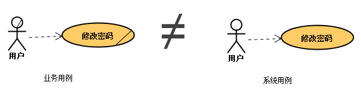

# 需求用例编写指南

## 一. 需求用例定义

### 1.1 什么是用例

**用例（Use Case）是指用户与系统某个连贯功能交互的场景。**通常情况下，一个经过分析形成的系统表单或页面可认为是一个用例，如管理订单；逻辑过于复杂的表单或页面可适度拆分成多个用例，如添加订单、修改订单、删除订单。

用例可分为业务用例和系统用例，在UML中均以椭圆形表示，只是前者多了根斜线。本文所述针对后者，即用于开发的系统用例。

### 1.2 什么是用例文档

**用例文档**是描述用例详细功能需求的文档，属于**软件需求规约**（SRS，也叫软件需求规格说明书）的一部分，也是主体部分，其读者包括用户、开发和测试。软件需求规约的内容除用例文档外，还包括项目背景、适用范围、系统目标、业务术语、用例图、界面设计、性能要求等等。

## 二. 用例模板格式

**用例文档模板是用于约束和规范如何描述详细需求的格式化文件。**目前存在一些本质上没有差别、只是部分术语有所不同的常用模板，但尚无公认的标准。相比某个模板的细节而言，公司或项目自身的标准化要重要的多，因此无需拘泥于模板的形式，适合即可。

| 常用模板 | 本项目使用的模板 |
| :--- | :--- |
| 用例名称 | 用例名称 |
| 用例描述 | 用例描述 |
| 优先级 | 优先级 |
| 执行者/辅助执行者 | 创建权限、编辑权限、查阅权限、审批流程 |
| 涉众利益 |  |
| 前置条件 |  |
| 后置条件 |  |
| 基本路径/分支路径/扩展路径 | 操作路径 |
| 字段列表 | 表单字段、列表字段、查询字段 |
| 业务规则 | 排序规则、编码规则、业务规则 |
| 包含用例 | 关联用例 |
| 设计约束/非功能性需求 | 其他说明 |

### 2.1 用例名称

1. 用例名称是每个用例文档的**唯一标识**，不可重名。
2. 使用明确的**动宾结构**，如查询订单、申请物资（根据汉语语法习惯，也可使用订单查询、物资申请）。_不明确的动词如“进行”、“使用”，不明确的宾语如“数据”、“表格”。_
3. 一般情况下，简单的 CRUD 操作可以统称为管理xx、维护xx、设置xx（或xx管理、xx维护、xx设置）。
4. 中文名称前增加代码标识以便排序和搜索，如“UC-HR-001\_员工档案管理”。

### 2.2 优先级

1. 目的是尽早确定系统应具备的最重要的功能，以合理安排项目进度及目标。
2. 通常分为**高、中、低**三类。必须实现的核心业务需求为高，如组织架构、员工档案；与核心需求关联性不强（相对独立）但依然不可或缺的为中，如人员缺口动态计划；不影响正常运作的优化增强型需求、或使用频率极低的需求、或绝对独立的简单需求为低，如培训案例库。

### 2.3 权限说明

1. 主体必须是**岗位名称**（创建权限也有可能是系统），而非具体的人。
2. 必须明确**权限范围**，如可创建/编辑/查阅哪些按钮、哪些记录或哪些字段。

### 2.4 审批流程

1. 流程节点的主体必须是岗位名称，而非具体的人。
2. 必须明确流程分支情况，如什么情况下由谁审批，什么情况下需要不同级别的领导审批。

> 权限和流程属于系统架构的基础，设计上因当较为灵活，可适应频繁变更，故在用例文档中体现的目的仅作为设计的参考，并非开发的固化依据。真正准确的权限和流程配置，属于实施阶段数据初始化的一部分。

### 2.5 操作路径

**操作路径用于描述用户与系统交互的过程**，包括正常路径（也叫基本路径）和异常路径（也叫扩展路径）两部分。其主语必须是用户或系统。

典型的编写格式如： 

> 1. 用户点击“添加”按钮；
> 2. 系统显示“基本信息”界面；
> 3. 用户填写基本信息；
> 4. 用户点击“提交”按钮；
> 5. 系统检测数据合法性；
>
>    5.1 合法：系统提示保存成功；
>
>    5.2 不合法：系统提示输入有误；

### 2.6 字段列表

理论上任何复杂页面的字段均可归纳成**表单、列表、查询**三种类型，理解其含义是沟通和编写用例的必要前提。“查询”字段位于页面的 header，点击查询按钮后 body 显示“列表”结果，点击列表行进入“表单”详情。**需求用例中的字段只体现用户关心的可见字段，而非设计所需临时或隐藏字段。**

对于列表字段，罗列字段名即可；对于表单/查询字段的描述，包括如下事先约定的描述方式：

* 序号：用于体现字段的显示顺序。
* 字段名：字段的中文名称。
* 输入方式：只读、文本框、下拉选单、日期选择控件、时间选择控件、弹窗选择等。
* 数据来源：对于选择型和只读型数据，必须指定其数据来源或者数据枚举。
* 合法性：对于非选择输入型数据，必须明确字段允许的数据范围和格式。
* 是否必填。
* 默认值。

对于某些含少量记录、少量字段的用例，表单页面也可以省略，直接在列表页操作，该方式主要应用于简单的基础数据页面如请假类型维护。

典型的编写格式如：

> 1. 档案号：只读（由 UC-HR-100\_员工报到申请 自动生成）；
> 2. 姓名：文本框，最大长度20，必填；
> 3. 公司：下拉选单（UC-BD-001\_人事公司维护，公司代码\_全称），必填；
> 4. 部门：组织架构选窗（见通用需求），必填；
> 5. 岗位：下拉选单（UC-BD-002\_岗位维护，岗位代码\_名称），必填；
> 6. 身份证号码：文本框（身份证号码格式，见通用需求），必填；
> 7. 出生日期：日期控件，必填，默认从“身份证号码”中获取第7～14位数字；

### 2.7 业务规则

业务规则逐条描述该用例所包含的所有功能或约束，以及和其他用例之间的交互关系。例如“绩效工资”的计算规则：

> 绩效工资 = 绩效工资标准 × 绩效考核系数 × 考核月数； 其中“绩效工资标准”从 UC-HR-603\_基本薪酬档案管理 获取；“绩效考核系数”先到 UC-HR-503\_员工绩效考核申请 查询“考核月份”与“核算月份”的上月相同的、已归档的记录（隔月绩效），再根据记录中的“公司”、“绩效等级”到 UC-HR-505\_绩效等级与系数维护 中获取；“考核月数”先根据“公司”、“岗位”到 UC-HR-501\_岗位绩效考核指标管理 查询“考核周期”……

### 2.8 其他说明

所有有助于理解和开发的内容，如果没有相关要求可留空，默认参照通用需求。具体包括以下几方面：

* 设计约束：界面、平台、中间件、语言、接口等。
* 非功能性需求：安全性、易用性、性能、可扩展性等。
* 需求解释：需求产生的来龙去脉、确认过程等。
* 初始化数据：简单且重要的初始化数据示例。
* 注意事项
* 遗留问题

## 三. 用例编写规范

### 3.1 与界面设计分离

界面设计（UI）是需求的一部分，但不建议体现在用例文档，因为一方面UI可能会在保持功能需求不变的情况下改版，另一方面用例对UI的表现力并不强。绘制低逼真度的界面有助于理解、沟通和确认，可作为用例文档的辅助手段。

企业管理软件对UI的要求并不高，用户也常常提不出太多想法或者无所谓，建议制定统一的UI规范，例如风格、布局、颜色、字体、表单页、列表页、标签页、各种控件、各种交互方式等。

### 3.2 与系统设计分离

功能需求与系统设计分离几乎是软件工程的共识，其目的是避免过多地限制系统设计的发挥。那么问题来了，**如何区分需求与设计呢？**一种经典回答是“**需求关注做什么，设计关注怎么做”**。

> 例如：用户要求记录操作时间属于需求，至于取客户端时间还是服务器时间，又或是国家授时中心的时间属于设计。   
>   
> 又如：用户要求在订单中显示已发货量属于需求，而实现方式是即时累计每次发货量，还是在每次发货时将发货量累计到订单属于设计。

然而很多情况下，“做什么”和“怎么做”的界限其实并不明显， “做什么”和“怎么做” 往往可以相互转换。“订单中显示已发货量”可以认为是做什么，也可以认为是怎么做。因为用户可能只是想了解订单的发货量，并不一定要在订单中显示，在订单中显示只是实现方法之一。所以问题又来了，**如何区分“做什么”和“怎么做”？**

> 这是“做什么”还是“怎么做”？  
>   
> ****原始需求：实现绩效考核申请功能  
> 方案1：绩效考核申请  
> 方案2：方案1+岗位考核指标管理  
> 方案3：方案2+考核指标库管理  
> 方案4：方案3+指标类型维护  
>   
> 为了满足业务变更和可维护性等隐性需求，一个看似简单的业务需求可能衍生出多种系统需求，这正是需求分析师引导用户预测需求的职责所在。无论最终采用哪种方案，都会对用户使用产生直接影响，所以都需要征求用户意见。因为你设计（或分析）出来的、比原始需求更复杂、更灵活的方案，未必是不可或缺的，也未必是用户乐意接受的。

> 这是“做什么”还是“怎么做”？   
>   
> “绩效考核系数”从“绩效考核申请”查询“考核月份”与“核算月份”的上月相同的、已归档的记录，再根据记录中的“公司”、“绩效等级”从“绩效等级与系数维护”查询“绩效系数”。  
>   
> 看似细致到接近伪代码、有干扰设计之嫌的描述，是“做什么”还是“怎么做”呢？用户可能会说，他就是要这个系数，至于怎么获取是开发的事。但作为需求分析师如果不这么写，开发人员是否清楚该怎么获取？是否知道是“上月”还是“本月”，该带“公司”还是不带“公司”查询？

综上，“做什么”和“怎么做”并不能很好地区分需求和设计，因为它们的界限本身是模糊的，因此更恰当的答案或许是：**用户看得见的叫需求，看不见的叫设计。**只要用户看得见，只要开发人员不问就不会做，用例文档应事无巨细都记录在案。

某些情况下，用户可能对系统有特别的要求，需要干涉看不见的部分，即会出现需求与系统设计分离的特例——**设计约束**，此时的设计其实也变成了需求。

> 例如，用户要求必须从国家授时中心获取准确时间，必须在发货时累加发货量以保证效率，必须使用SSH框架、必须使用Oracle数据库，必须使用jQuery写前端，必须使用缓存机制提取员工信息等等。

### 3.2 统一的行文、语法和格式

1. 使用自然语言，而不是技术语言。
2. 采用简单明确的语法，如主谓宾格式。
3. 只写可观测的，不写系统活动（如：建立数据库连接、执行SQL）。
4. 防止过度图形化，重点在于文本。
5. 保持严格一致的命名，如用例名、字段名、控件名、公司名、业务术语等。
6. 使用统一的文档格式（样式），包括字体、文字大小、标点符号、颜色、序号、缩进等。
7. 不要为了美观而在不恰当的位置使用令人费解的符号，如斜杠、加号、星号甚至 emoji。
8. 不要描述与当前用例无关的内容混淆视听。
9. 当引用的外部用例或当前用例的其他部分发生变更时，需及时同步更新。
10. 增强文字的严谨性，试想如果不当面口头解释，对方能否清楚做什么。

### 3.3 谨记需求四要素

* **明确性（无二义性）**

自然语言的最大弊端是容易产生二义性，因此在文档表述时需仔细斟酌，避免过多的修饰，避免让人曲解。假设自己是从未接触过需求的开发者，尝试理解自己所写的内容。

> 如：查询车票行情。  
> 车票指的是汽车票、火车票还是飞机票？行情指的是价格还是数量？   
>   
> 如：查询在职员工。  
> 什么叫在职？实习算不算？兼职算不算？停薪留职算不算？提出离职申请但还没离职的算不算？标准写法是查询状态为xx、xx、xx的员工。   
>   
> 如：某编码规则是年份+月份+流水号。  
> 年份取几位？月份1位时补不补0？流水号几位？数字还是字母？和年月有没有关系？超过最大流水号怎么处理？

* **完整性**

为确保需求的完整性，需要分析人员对业务框架有清晰的认识，对管理流程有足够的了解，才能不断挖掘提炼用户尚未深入考虑的需求。如果存在临时决定的、或未经确认的需求，应该以某种显式的方式体现出来，如标红、加批注等。

> 如：用户需要实现考勤管理，但可能并没有去想考勤的涉及面和复杂性，如果按用户提出的表面需求去开发，很可能造成返工。

* **一致性**

**业务需求**是管理层面的最高目标；**用户需求**是用户要求系统完成的任务；**功能需求**是软件产品必须实现的任务。因此，功能需求（系统用例）应与用户需求（业务用例）保持一致，用户需求应与业务需求保持一致，换句话说，要保证功能需求、用户需求和业务需求的继承关系。

* **可测试性**

在需求层面，软件的可测试性主要包括**可见性和可控性**。前者指数据的输入、输出、引用、影响都能被准确地捕捉到；后者指向系统输入或修改数据的可能性，主要体现在压力、性能测试方面，如模拟100个用户同时登录是可控的，模拟100个用户在高温酷暑环境登录则不可控。

系统测试的职责并非从写代码或完成代码之后才开始履行，而是从需求分析就已经开始。也就是说，需求分析的结果应该是可测试的。

## 四. 用例的局限性

1. 不适合捕获非功能性需求，要借助其他方法弥补。
2. 不能自动保证结构清晰，要依靠书写者的技巧。
3. 并不像支持者说的那样易于理解，要辅以适当的学习。

